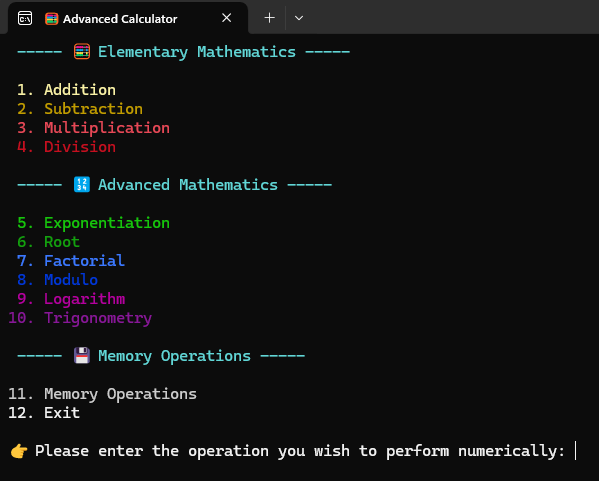
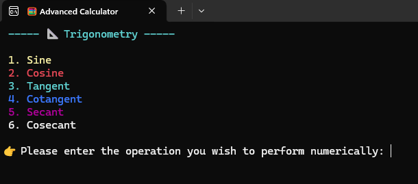
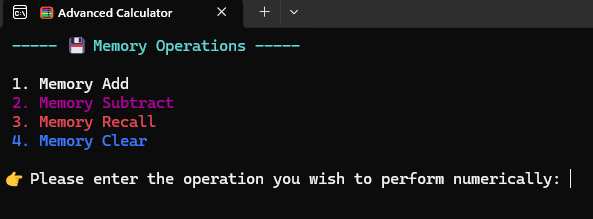
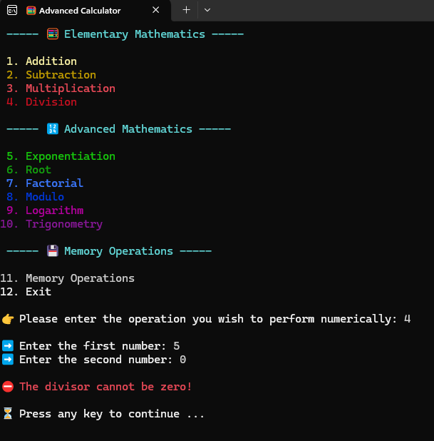
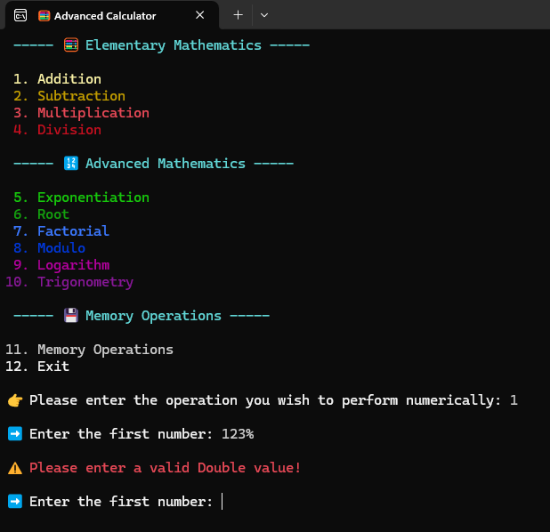

# Advanced Console Calculator

## Description
This is a console-based calculator application built with C# and .NET. It provides a wide range of mathematical operations, including basic arithmetic, advanced functions like exponentiation and logarithms, trigonometric calculations, and memory operations.

## Features
- **Basic Arithmetic:** Addition, Subtraction, Multiplication, Division.
- **Advanced Operations:** Exponentiation, Root, Factorial, Modulo, Logarithm.
- **Trigonometry:** Sine, Cosine, Tangent, Cotangent, Secant, Cosecant (in degrees).
- **Memory Functions:** Add to memory, Subtract from memory, Recall memory, Clear memory.
- **User-Friendly Console Interface:** Clear menu navigation and colored output for better readability.
- **Robust Input Handling:** Validates user input and provides error messages for invalid entries.

## Screenshots
Here are some screenshots of the application in action:

### Main Menu


### Trigonometry Menu


### Memory Operations Menu


### Division by Zero Error


### Invalid Input Error


## How to Use
1.  **Clone the repository:**
    ```bash
    git clone https://github.com/Kaaner4mir/console-labor.git
    cd console-labor
    ```
2.  **Navigate to the project directory:**
    ```bash
    cd AdvancedCalculator
    ```
3.  **Run the application:**
    ```bash
    dotnet run
    ```
4.  **Follow the on-screen menu:** The application will display a main menu with various operations. Enter the number corresponding to the desired operation.
5.  **Provide input:** For operations requiring numbers, follow the prompts to enter your values.
6.  **View results:** The result of the operation will be displayed, and you will be prompted to press any key to continue.

## Project Structure
-   `Initializer.cs`: The application's entry point and main loop, handling menu navigation and operation dispatch.
-   `Enums.cs`: Contains enumerations for various menu options and operation types, enhancing type safety and readability.
-   `UI/`
    -   `Menu.cs`: Manages the display of main and sub-menus (Trigonometry, Memory) with colored text.
    -   `ConsoleManager.cs`: Provides utility methods for colored console output and robust user input handling, including type conversion and validation.
-   `Operations/`
    -   `Elementary.cs`: Implements basic arithmetic operations (addition, subtraction, multiplication, division).
    -   `Advanced.cs`: Implements advanced mathematical operations (exponentiation, root, factorial, modulo, logarithm) and trigonometric functions.
    -   `Memory.cs`: Manages memory operations (add, subtract, recall, clear) with a persistent static memory value.

## Technologies Used
-   **C#**
-   **.NET 8.0**

## License
This project is licensed under the MIT License - see the [LICENSE](LICENSE) file for details.

## Author
- Kaaner4mir
