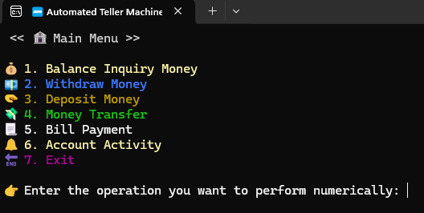
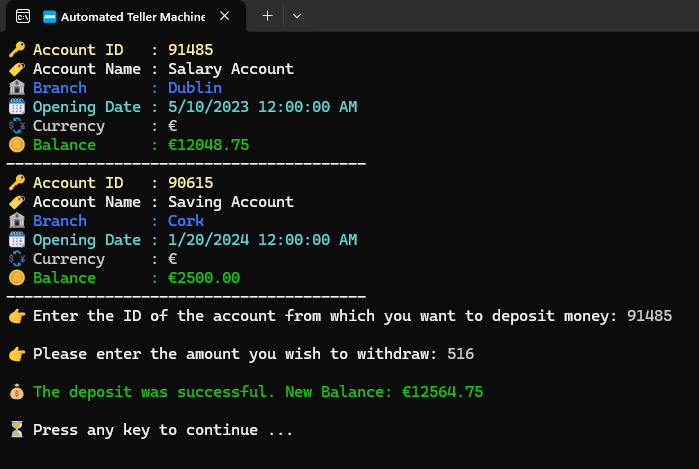
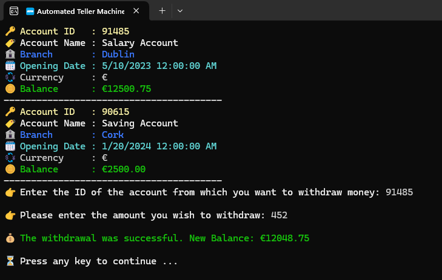
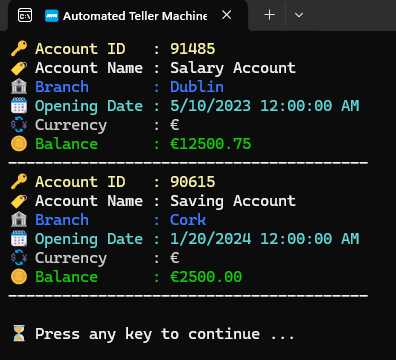
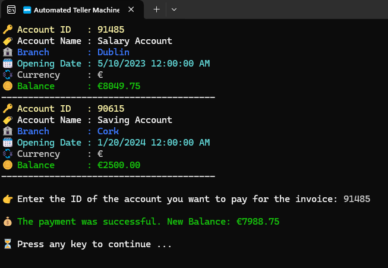
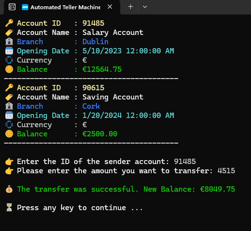
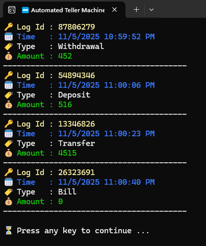
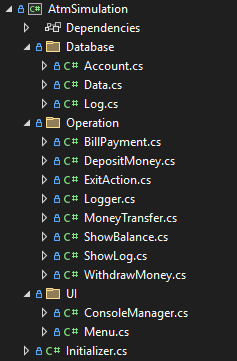

# 💸💳 ATM Simulation

## 📝 Description

This project is a console-based ATM (Automated Teller Machine) simulation application developed using C# and .NET. It provides a robust and interactive command-line interface for users to perform common banking operations securely. The application is designed to simulate real-world ATM functionalities, allowing users to manage their accounts with features like depositing, withdrawing, checking balances, paying bills, and transferring money between accounts. The primary goal is to demonstrate object-oriented programming principles, secure transaction handling, and a user-friendly console experience.

## ✨ Features

- **➕ Deposit Money**: Users can safely deposit funds into their accounts. The system includes validation to ensure that deposit amounts are positive and updates the account balance in real-time. All deposits are logged.
- **➖ Withdraw Money**: Users can withdraw specified amounts from their accounts. The system meticulously checks for sufficient funds and prevents overdrafts. Withdrawals are recorded in the transaction log.
- **📊 Show Balance**: Provides users with an instant view of their current account balance, ensuring transparency and up-to-date financial information.
- **🧾 Bill Payment**: Facilitates the payment of various utility bills (e.g., electricity, water, internet) by deducting the corresponding amount from the user's account. This feature includes basic bill identification and processing.
- **💸 Money Transfer**: Enables users to securely transfer funds to other accounts within the simulation. This requires validating the recipient's account and ensuring the sender has adequate funds. Transfers are fully logged.
- **📜 Transaction Log**: Maintains a comprehensive record of all financial activities performed by the user, including deposits, withdrawals, transfers, and bill payments. Users can view their transaction history for auditing and personal finance tracking.
- **🔐 Account Management**: Basic in-memory account management with unique account identifiers.
- **🤝 User-Friendly Console Interface**: Features clear menu navigation, colored output for better readability, and intuitive prompts for user interaction.
- **🛡️ Robust Input Handling**: Incorporates input validation and error handling to guide users with meaningful messages for invalid entries or operational failures.

## 📸 Screenshots

Here are some screenshots illustrating the application's interface and functionalities:

### Main Menu


### Deposit Money


### Withdraw Money


### Show Balance


### Bill Payment


### Money Transfer


### Transaction Log


### Folder Structure


## 🚀 How to Use

1.  **🔗 Clone the repository:**
    ```bash
    git clone https://github.com/YOUR_USERNAME/ConsoleLab.git
    cd ConsoleLab
    ```
2.  **📂 Navigate to the project directory:**
    ```bash
    cd AtmSimulation
    ```
3.  **▶️ Run the application:**
    ```bash
    dotnet run
    ```
4.  **🖥️ Follow the on-screen menu:** The application will present a main menu with several banking options. Enter the number corresponding to your desired operation.
5.  **⌨️ Provide input:** For transactions like deposits, withdrawals, or transfers, follow the prompts to enter necessary details such as amounts, account numbers, or bill information.
6.  **✅ View results:** After each operation, the result (e.g., successful transaction, error message, updated balance) will be displayed. You will then be prompted to press any key to return to the main menu.

## 🏗️ Project Structure

The `AtmSimulation` project is structured into logical components to enhance maintainability and readability:

-   `AtmSimulation.csproj`: The project file for the C# application.
-   `Initializer.cs`: The application's entry point (`Main` method) and primary orchestrator, responsible for initializing the ATM system and managing the main application loop.
-   `Database/`:
    -   `Account.cs`: Defines the `Account` class, encapsulating account details such as account number, balance, and account holder information.
    -   `Data.cs`: Manages the in-memory collection of `Account` objects and provides methods for accessing and modifying account data.
    -   `Log.cs`: Defines the `Log` class, used to record details of each financial transaction for auditing purposes.
-   `Operation/`:
    -   `BillPayment.cs`: Handles the logic for processing bill payments.
    -   `DepositMoney.cs`: Contains the logic for depositing funds into an account.
    -   `ExitAction.cs`: Manages the application exit process.
    -   `Logger.cs`: Provides utility methods for logging transactions to the `Log` objects.
    -   `MoneyTransfer.cs`: Implements the logic for transferring funds between accounts.
    -   `ShowBalance.cs`: Manages the display of an account's current balance.
    -   `ShowLog.cs`: Handles the retrieval and display of transaction history.
    -   `WithdrawMoney.cs`: Contains the logic for withdrawing funds from an account.
-   `UI/`:
    -   `ConsoleManager.cs`: Provides utility methods for managing console output (e.g., colored text, clear screen) and robust user input handling, including validation and type conversion.
    -   `Menu.cs`: Responsible for displaying various menus (e.g., main menu, operation menus) and capturing user selections.
-   `Images/`: Contains all the screenshot images used in this README.

## 💻 Technologies Used

-   **C#**: The core programming language for building the robust and scalable console application.
-   **Microsoft .NET 8.0**: The comprehensive development framework providing the runtime environment, extensive libraries, and tools necessary for cross-platform application development.
-   **Object-Oriented Programming (OOP)**: Fundamental design paradigm applied throughout the project to achieve modularity, reusability, and maintainability through classes, objects, inheritance, and polymorphism.

## 📄 License

This project is licensed under the MIT License - see the [LICENSE](LICENSE) file for details.

## ✍️ Author

- Kaaner4mir
