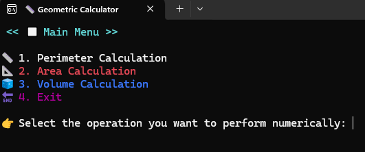
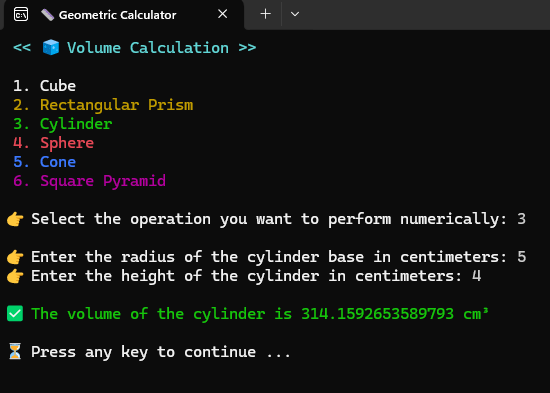
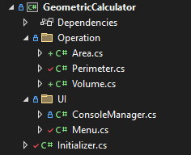

# 📐 Geometric Calculator

## 📝 Description
This is a console-based application built with C# and .NET that allows users to perform various geometric calculations. It can calculate areas, perimeters, and volumes of different shapes.

## ✨ Features
- **🔢 Area Calculations:** Calculate the area of various 2D shapes (e.g., circles, squares, triangles).
- **📏 Perimeter Calculations:** Determine the perimeter of different 2D shapes.
- **📦 Volume Calculations:** Compute the volume of 3D shapes (e.g., cubes, spheres, cylinders).
- **🤝 User-Friendly Console Interface:** Clear menu navigation and colored output for better readability.
- **🛡️ Robust Input Handling:** Validates user input and provides error messages for invalid entries.

## 📸 Screenshots
Here are some screenshots of the application in action:

### Main Menu


### Operation Example


### Project Structure


## 🚀 How to Use
1.  **🔗 Clone the repository:**
    ```bash
    git clone https://github.com/Kaaner4mir/console-labor.git
    cd console-labor
    ```
2.  **📂 Navigate to the project directory:**
    ```bash
    cd GeometricCalculator
    ```
3.  **▶️ Run the application:**
    ```bash
    dotnet run
    ```
4.  **🖥️ Follow the on-screen menu:** The application will display a main menu with various operations. Enter the number corresponding to the desired operation.
5.  **⌨️ Provide input:** For operations requiring numbers, follow the prompts to enter your values.
6.  **✅ View results:** The result of the operation will be displayed, and you will be prompted to press any key to continue.

## 🏗️ Project Structure
-   `Initializer.cs`: The application's entry point and main loop, handling menu navigation and operation dispatch.
-   `UI/`
    -   `Menu.cs`: Manages the display of main and sub-menus with colored text.
    -   `ConsoleManager.cs`: Provides utility methods for colored console output and robust user input handling, including type conversion and validation.
-   `Operation/`
    -   `Area.cs`: Implements area calculations for various shapes.
    -   `Perimeter.cs`: Implements perimeter calculations for various shapes.
    -   `Volume.cs`: Implements volume calculations for various shapes.

## 💻 Technologies Used
-   **C#**
-   **.NET 8.0**

## 📄 License
This project is licensed under the MIT License - see the [LICENSE](LICENSE) file for details.

## ✍️ Author
- Kaaner4mir

