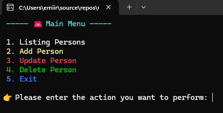
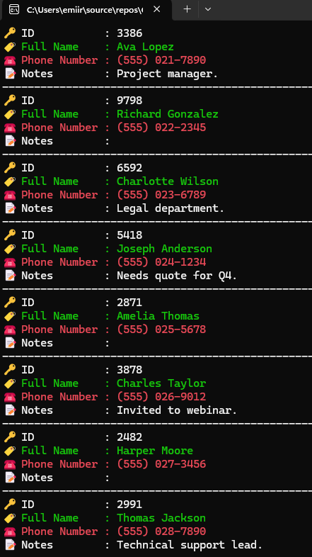

# 📞 Phone Directory

## 📝 Description

This is a console-based Phone Directory application built with C# and .NET. It allows users to manage a list of contacts, including adding, listing, updating, and deleting entries.

## ✨ Features

- **➕ Add New Contact:** Add new person records with name, surname, and phone number.
- **📜 List All Contacts:** Display all registered contacts in alphabetical order.
- **🔄 Update Contact:** Modify the phone number of an existing contact.
- **🗑️ Delete Contact:** Remove a contact from the directory.
- **🤝 User-Friendly Console Interface:** Clear menu navigation and colored output for better readability.
- **🛡️ Robust Input Handling:** Validates user input and provides error messages for invalid entries.

## 📸 Screenshots

Here are some screenshots of the application in action:

### Main Menu



### List Persons



## 🚀 How to Use

1.  **🔗 Clone the repository:**
    ```bash
    git clone https://github.com/Kaaner4mir/console-labor.git
    cd ConsoleLab
    ```
2.  **📂 Navigate to the project directory:**
    ```bash
    cd PhoneDirectory
    ```
3.  **▶️ Run the application:**
    ```bash
    dotnet run
    ```
4.  **🖥️ Follow the on-screen menu:** The application will display a main menu with various operations. Enter the number corresponding to the desired operation.
5.  **⌨️ Provide input:** For operations requiring information, follow the prompts to enter the values.
6.  **✅ View results:** The result of the operation will be displayed, and you will be prompted to press any key to continue.

## 🏗️ Project Structure

- `Initializer.cs`: The application's entry point and main loop, handling menu navigation and operation dispatch.
- `Data/`
  - `Person.cs`: Defines the `Person` class, representing a contact with name, surname, and phone number.
  - `Database.cs`: Manages the in-memory list of `Person` objects, providing methods for adding, listing, updating, and deleting contacts.
- `Services/`
  - `Operation.cs`: Contains the core logic for the phone directory operations, interacting with the `Database` and `UI` components.
- `UI/`
  - `Menu.cs`: Manages the display of main menus with colored text.
  - `ConsoleManager.cs`: Provides utility methods for colored console output and robust user input handling, including type conversion and validation.

## 💻 Technologies Used

- **C#**
- **.NET 8.0**

## 📄 License

This project is licensed under the MIT License - see the [LICENSE](LICENSE) file for details.

## ✍️ Author

- Kaaner4mir
